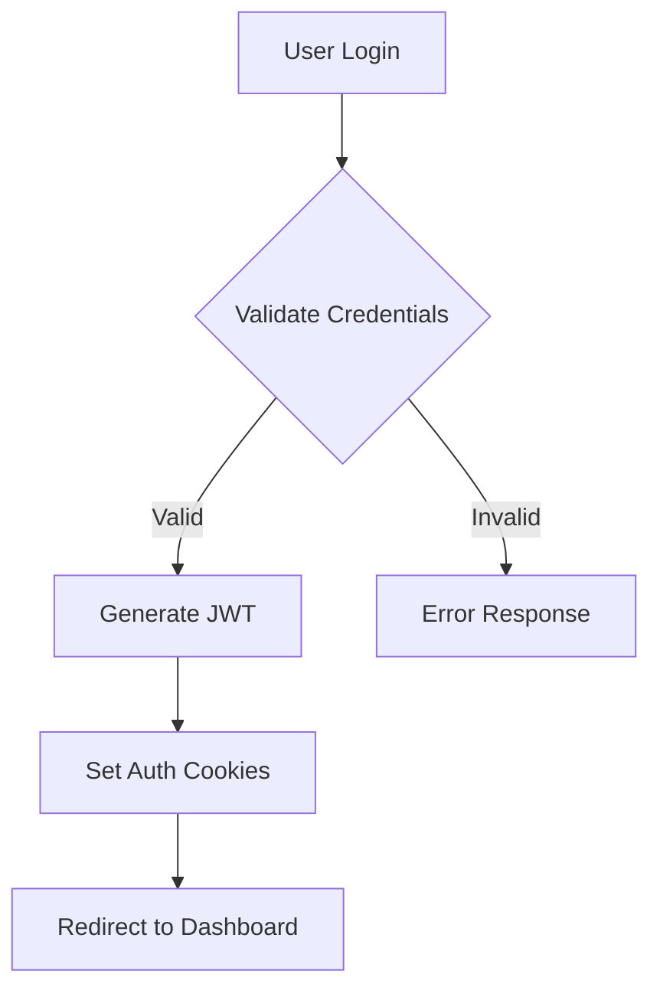
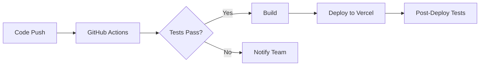

# Architecture Documentation

## System Overview

Kusina Amadeo is built using a modern web architecture following these key principles:
- Server-Side Rendering (SSR) with Next.js 13
- Component-Based Development
- API-First Design
- Responsive and Mobile-First Design
- Dark Theme Implementation

## Architecture Diagram

```
┌─────────────────────────────────────────────────────────────┐
│                     Client (Browser)                         │
└───────────────────────────┬─────────────────────────────────┘
                            │
┌───────────────────────────▼─────────────────────────────────┐
│                     Next.js Frontend                         │
│  ┌─────────────┐    ┌──────────────┐    ┌──────────────┐   │
│  │    Pages    │    │  Components  │    │    Hooks     │   │
│  └─────────────┘    └──────────────┘    └──────────────┘   │
│  ┌─────────────┐    ┌──────────────┐    ┌──────────────┐   │
│  │   Layouts   │    │   Providers  │    │    Utils     │   │
│  └─────────────┘    └──────────────┘    └──────────────┘   │
└───────────────────────────┬─────────────────────────────────┘
                            │
┌───────────────────────────▼─────────────────────────────────┐
│                      API Layer                               │
│  ┌─────────────┐    ┌──────────────┐    ┌──────────────┐   │
│  │  REST APIs  │    │   GraphQL    │    │  WebSockets  │   │
│  └─────────────┘    └──────────────┘    └──────────────┘   │
└───────────────────────────┬─────────────────────────────────┘
                            │
┌───────────────────────────▼─────────────────────────────────┐
│                    Data Layer                                │
│  ┌─────────────┐    ┌──────────────┐    ┌──────────────┐   │
│  │  PostgreSQL │    │    Prisma    │    │    Redis     │   │
│  └─────────────┘    └──────────────┘    └──────────────┘   │
└─────────────────────────────────────────────────────────────┘
```

## Directory Structure

```
kda/
├── src/
│   ├── app/                    # Next.js 13 app directory
│   │   ├── (auth)/            # Authentication routes
│   │   │   ├── login/
│   │   │   └── register/
│   │   ├── (dashboard)/       # Admin dashboard routes
│   │   │   ├── menu/
│   │   │   ├── orders/
│   │   │   └── settings/
│   │   ├── about/             # About page
│   │   ├── menu/              # Menu pages
│   │   └── layout.tsx         # Root layout
│   ├── components/            # Reusable components
│   │   ├── admin/            # Admin components
│   │   │   ├── AdminSidebar/
│   │   │   ├── AdminHeader/
│   │   │   └── Dashboard/
│   │   ├── ui/               # UI components
│   │   │   ├── Button/
│   │   │   ├── Card/
│   │   │   └── Modal/
│   │   └── shared/           # Shared components
│   │       ├── Navbar/
│   │       └── Footer/
│   ├── lib/                  # Utility functions
│   │   ├── api/             # API utilities
│   │   ├── auth/            # Auth utilities
│   │   └── db/              # Database utilities
│   ├── providers/           # Context providers
│   │   ├── ThemeProvider/
│   │   └── AuthProvider/
│   └── styles/              # Global styles
├── public/                  # Static assets
├── prisma/                 # Database schema
└── docs/                  # Documentation
```

## Core Technologies

### Frontend
- **Next.js 13**: App Router, Server Components, Client Components
- **React**: Hooks, Context, Custom Hooks
- **TypeScript**: Type safety, Interfaces, Generics
- **Tailwind CSS**: Utility-first CSS, Custom Themes
- **Framer Motion**: Animations, Transitions
- **Shadcn UI**: Component Library
- **React Query**: Data Fetching, Caching
- **Zustand**: State Management

### Backend
- **Next.js API Routes**: REST API Endpoints
- **Prisma**: ORM, Database Migrations
- **PostgreSQL**: Primary Database
- **NextAuth.js**: Authentication
- **tRPC**: Type-safe API Layer
- **Zod**: Schema Validation

### Development Tools
- **ESLint**: Code Linting
- **Prettier**: Code Formatting
- **Husky**: Git Hooks
- **Jest**: Unit Testing
- **Cypress**: E2E Testing
- **TypeDoc**: Documentation Generation

## Data Flow

### Client-Side Flow
1. User interacts with UI
2. React Component triggers action
3. State update via Zustand/Context
4. UI re-renders with new state
5. API calls made if needed

### Server-Side Flow
1. Request hits Next.js API route
2. Authentication/Authorization check
3. Data validation
4. Database operation via Prisma
5. Response sent back to client

## State Management

### Global State (Zustand)
```typescript
interface StoreState {
  theme: 'dark' | 'light';
  cart: CartItem[];
  user: User | null;
  setTheme: (theme: 'dark' | 'light') => void;
  addToCart: (item: CartItem) => void;
  setUser: (user: User | null) => void;
}

const useStore = create<StoreState>((set) => ({
  theme: 'dark',
  cart: [],
  user: null,
  setTheme: (theme) => set({ theme }),
  addToCart: (item) => set((state) => ({ 
    cart: [...state.cart, item] 
  })),
  setUser: (user) => set({ user }),
}));
```

### Local State Management
- Component-level state using useState
- Form state using React Hook Form
- Query state using React Query

## Authentication Flow

1. **Login Process**


2. **Protected Routes**
```typescript
const ProtectedRoute = ({ children }: { children: React.ReactNode }) => {
  const { user, loading } = useAuth();
  
  if (loading) return <LoadingSpinner />;
  if (!user) return <Navigate to="/login" />;
  
  return <>{children}</>;
};
```

## Performance Optimization

### Code Splitting
- Dynamic imports
- Route-based splitting
- Component lazy loading

### Caching Strategy
- React Query caching
- Static page generation
- Incremental Static Regeneration

### Image Optimization
- Next.js Image component
- WebP format
- Responsive images
- Lazy loading

## Security Measures

### API Security
- Rate limiting
- CORS configuration
- Input validation
- SQL injection prevention

### Authentication Security
- JWT with secure flags
- Password hashing
- CSRF protection
- XSS prevention

## Testing Strategy

### Unit Testing
```typescript
describe('MenuItem Component', () => {
  it('renders correctly', () => {
    const item = {
      id: '1',
      name: 'Test Item',
      price: 9.99,
      description: 'Test Description'
    };
    
    render(<MenuItem item={item} />);
    expect(screen.getByText('Test Item')).toBeInTheDocument();
  });
});
```

### Integration Testing
```typescript
describe('Cart Flow', () => {
  it('adds item to cart', async () => {
    const { user } = renderWithProviders(<MenuPage />);
    
    await user.click(screen.getByText('Add to Cart'));
    expect(screen.getByText('1 item in cart')).toBeInTheDocument();
  });
});
```

## Deployment Pipeline



## Monitoring and Analytics

### Performance Monitoring
- Vercel Analytics
- Core Web Vitals
- Custom performance metrics

### Error Tracking
- Sentry integration
- Error boundaries
- Custom error logging

### User Analytics
- Google Analytics
- Custom event tracking
- User behavior analysis

## Future Considerations

### Scalability
- Serverless functions
- Edge computing
- Database sharding
- Caching layers

### Features
- Online ordering system
- Real-time order tracking
- Customer reviews
- Loyalty program

### Infrastructure
- Multi-region deployment
- Backup strategy
- Disaster recovery
- Load balancing
