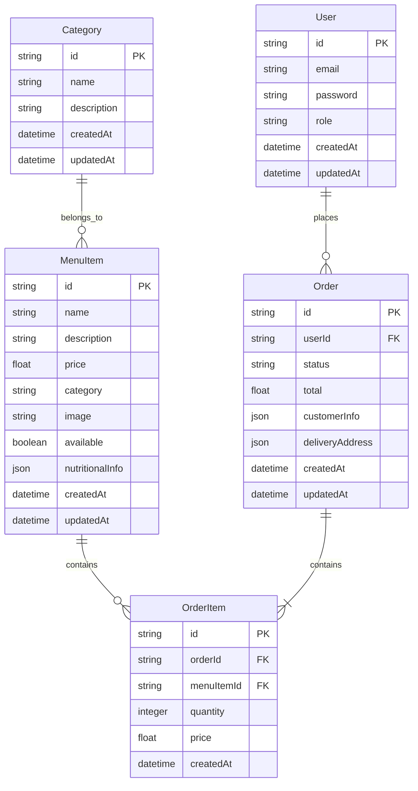

# Database Documentation

## Overview

This document details the database design and implementation for the Kusina Amadeo website.

## Database Schema

### Entity Relationship Diagram (ERD)



## Prisma Schema

```prisma
// schema.prisma

datasource db {
  provider = "postgresql"
  url      = env("DATABASE_URL")
}

generator client {
  provider = "prisma-client-js"
}

model User {
  id        String   @id @default(cuid())
  email     String   @unique
  password  String
  role      Role     @default(USER)
  orders    Order[]
  createdAt DateTime @default(now())
  updatedAt DateTime @updatedAt

  @@map("users")
}

model MenuItem {
  id              String      @id @default(cuid())
  name            String
  description     String
  price           Float
  category        Category    @relation(fields: [categoryId], references: [id])
  categoryId      String
  image           String?
  available       Boolean     @default(true)
  nutritionalInfo Json?
  orderItems      OrderItem[]
  createdAt       DateTime    @default(now())
  updatedAt       DateTime    @updatedAt

  @@map("menu_items")
}

model Category {
  id          String     @id @default(cuid())
  name        String     @unique
  description String?
  menuItems   MenuItem[]
  createdAt   DateTime   @default(now())
  updatedAt   DateTime   @updatedAt

  @@map("categories")
}

model Order {
  id              String      @id @default(cuid())
  user            User?       @relation(fields: [userId], references: [id])
  userId          String?
  status          OrderStatus @default(PENDING)
  total           Float
  customerInfo    Json
  deliveryAddress Json?
  orderItems      OrderItem[]
  createdAt       DateTime    @default(now())
  updatedAt       DateTime    @updatedAt

  @@map("orders")
}

model OrderItem {
  id         String   @id @default(cuid())
  order      Order    @relation(fields: [orderId], references: [id])
  orderId    String
  menuItem   MenuItem @relation(fields: [menuItemId], references: [id])
  menuItemId String
  quantity   Int
  price      Float
  createdAt  DateTime @default(now())

  @@map("order_items")
}

enum Role {
  USER
  ADMIN
}

enum OrderStatus {
  PENDING
  CONFIRMED
  PREPARING
  READY
  DELIVERED
  CANCELLED
}
```

## Database Operations

### Queries

#### Get Menu Items with Category
```typescript
const getMenuItems = async () => {
  const items = await prisma.menuItem.findMany({
    include: {
      category: true,
    },
    where: {
      available: true,
    },
    orderBy: {
      createdAt: 'desc',
    },
  });
  return items;
};
```

#### Get Order with Items
```typescript
const getOrder = async (orderId: string) => {
  const order = await prisma.order.findUnique({
    where: { id: orderId },
    include: {
      orderItems: {
        include: {
          menuItem: true,
        },
      },
      user: {
        select: {
          email: true,
        },
      },
    },
  });
  return order;
};
```

### Mutations

#### Create Order
```typescript
const createOrder = async (data: CreateOrderInput) => {
  const order = await prisma.order.create({
    data: {
      userId: data.userId,
      total: data.total,
      customerInfo: data.customerInfo,
      deliveryAddress: data.deliveryAddress,
      orderItems: {
        create: data.items.map(item => ({
          menuItemId: item.menuItemId,
          quantity: item.quantity,
          price: item.price,
        })),
      },
    },
    include: {
      orderItems: true,
    },
  });
  return order;
};
```

#### Update Menu Item
```typescript
const updateMenuItem = async (id: string, data: UpdateMenuItemInput) => {
  const item = await prisma.menuItem.update({
    where: { id },
    data: {
      name: data.name,
      description: data.description,
      price: data.price,
      categoryId: data.categoryId,
      image: data.image,
      available: data.available,
      nutritionalInfo: data.nutritionalInfo,
    },
  });
  return item;
};
```

## Migrations

### Creating Migrations

```bash
# Create a new migration
npx prisma migrate dev --name add_nutritional_info

# Apply migrations to production
npx prisma migrate deploy
```

### Example Migration
```sql
-- Migration: add_nutritional_info
CREATE TYPE "OrderStatus" AS ENUM (
  'PENDING',
  'CONFIRMED',
  'PREPARING',
  'READY',
  'DELIVERED',
  'CANCELLED'
);

ALTER TABLE "menu_items"
ADD COLUMN "nutritionalInfo" JSONB;

CREATE INDEX "menu_items_category_id_idx"
ON "menu_items"("categoryId");
```

## Data Seeding

### Seed Script
```typescript
// prisma/seed.ts
import { PrismaClient } from '@prisma/client';
const prisma = new PrismaClient();

async function main() {
  // Create categories
  const mainCourse = await prisma.category.create({
    data: {
      name: 'Main Course',
      description: 'Main dishes',
    },
  });

  // Create menu items
  await prisma.menuItem.create({
    data: {
      name: 'Adobo',
      description: 'Filipino pork adobo',
      price: 250,
      categoryId: mainCourse.id,
      nutritionalInfo: {
        calories: 350,
        protein: 25,
        carbs: 10,
        fat: 20,
      },
    },
  });
}

main()
  .catch(e => console.error(e))
  .finally(async () => {
    await prisma.$disconnect();
  });
```

## Backup and Recovery

### Backup Script
```bash
#!/bin/bash
# backup.sh

DB_NAME="kusina_amadeo"
BACKUP_DIR="/backups"
DATE=$(date +%Y%m%d_%H%M%S)

# Create backup
pg_dump -Fc $DB_NAME > $BACKUP_DIR/backup_$DATE.dump

# Keep only last 7 days of backups
find $BACKUP_DIR -type f -mtime +7 -delete
```

### Recovery Script
```bash
#!/bin/bash
# restore.sh

DB_NAME="kusina_amadeo"
BACKUP_FILE=$1

# Restore from backup
pg_restore -d $DB_NAME $BACKUP_FILE
```

## Performance Optimization

### Indexes
```sql
-- Add indexes for frequently queried fields
CREATE INDEX "menu_items_category_id_idx" ON "menu_items"("categoryId");
CREATE INDEX "orders_user_id_idx" ON "orders"("userId");
CREATE INDEX "orders_status_idx" ON "orders"("status");
```

### Query Optimization
```typescript
// Use select to fetch only needed fields
const getOrderSummary = async (orderId: string) => {
  return prisma.order.findUnique({
    where: { id: orderId },
    select: {
      id: true,
      total: true,
      status: true,
      orderItems: {
        select: {
          quantity: true,
          price: true,
          menuItem: {
            select: {
              name: true,
            },
          },
        },
      },
    },
  });
};
```

## Monitoring and Maintenance

### Connection Pool
```typescript
// Configure connection pool
const prisma = new PrismaClient({
  log: ['query', 'info', 'warn', 'error'],
  datasources: {
    db: {
      url: process.env.DATABASE_URL,
    },
  },
  // Configure connection pool
  __internal: {
    engine: {
      connectionLimit: 10,
    },
  },
});
```

### Query Logging
```typescript
// Enable query logging
const prisma = new PrismaClient({
  log: [
    {
      emit: 'event',
      level: 'query',
    },
  ],
});

prisma.$on('query', async (e) => {
  console.log(`Query: ${e.query}`);
  console.log(`Duration: ${e.duration}ms`);
});
```

## Security

### Data Encryption
```typescript
// Encrypt sensitive data
import { encrypt, decrypt } from '../lib/encryption';

const createUser = async (data: CreateUserInput) => {
  const encryptedPassword = await encrypt(data.password);
  return prisma.user.create({
    data: {
      ...data,
      password: encryptedPassword,
    },
  });
};
```

### Access Control
```typescript
// Middleware for role-based access
const enforceAdmin = async (
  req: NextApiRequest,
  res: NextApiResponse,
  next: NextApiHandler
) => {
  const user = await getSession({ req });
  if (user?.role !== 'ADMIN') {
    return res.status(403).json({ error: 'Unauthorized' });
  }
  return next(req, res);
};
```

## Error Handling

### Database Errors
```typescript
try {
  await prisma.menuItem.create({
    data: menuItemData,
  });
} catch (error) {
  if (error instanceof Prisma.PrismaClientKnownRequestError) {
    if (error.code === 'P2002') {
      throw new Error('Menu item already exists');
    }
  }
  throw error;
}
```

### Transaction Handling
```typescript
const createOrderWithItems = async (orderData: OrderData) => {
  return prisma.$transaction(async (tx) => {
    const order = await tx.order.create({
      data: {
        userId: orderData.userId,
        total: orderData.total,
      },
    });

    await tx.orderItem.createMany({
      data: orderData.items.map((item) => ({
        orderId: order.id,
        menuItemId: item.menuItemId,
        quantity: item.quantity,
        price: item.price,
      })),
    });

    return order;
  });
};
```
